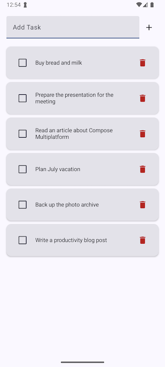

# ToDoOrbitMVIExample

A minimalist Android application template demonstrating the use of OrbitMVI and modern development practices, based on [Medium article](https://medium.com/@mikhaltchenkov/orbit-mvi-a-complete-guide-to-the-state-management-framework-39c28e05cdd3).

## Technologies

- **OrbitMVI** - framework for implementing the MVI (Model-View-Intent) pattern
- **Clean Architecture** - architectural approach to code organization
- **Jetpack Compose** - modern UI toolkit

## Features

- Clean Architecture with clear layer separation
- MVI pattern implementation using OrbitMVI
- Modern UI based on Jetpack Compose
- Ready for use in Kotlin Multiplatform projects

## Getting Started

1. Clone the repository
2. Open the project in Android Studio
3. Sync Gradle dependencies
4. Run the application

## Requirements

- Android Studio Meerkat Feature Drop or newer
- Kotlin 2.2.20 or newer
- Android SDK 26+ 

## References

- [OrbitMVI documentation](https://orbit-mvi.org/)

#MVI #OrbitMVI #Compose #CleanArchitecture